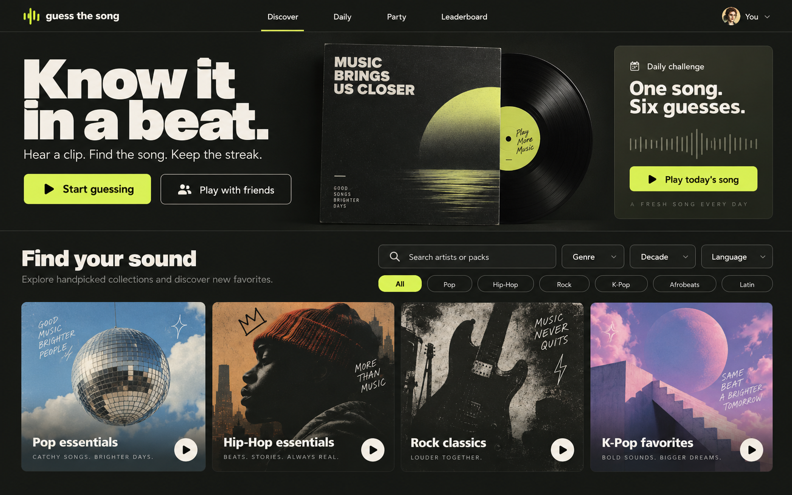
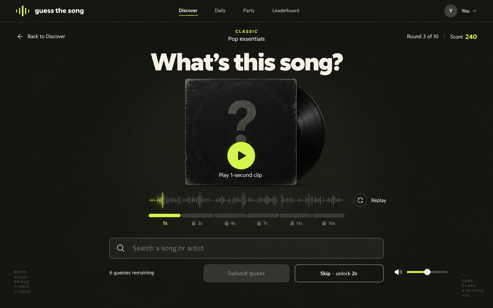
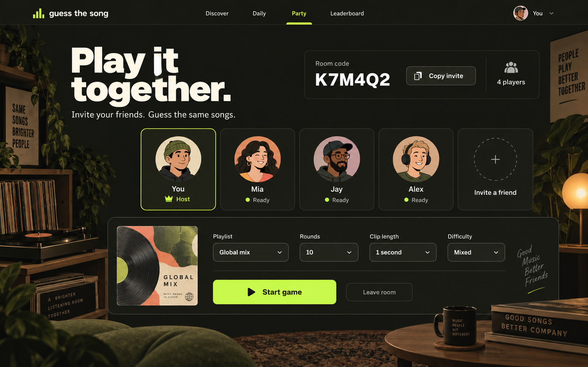
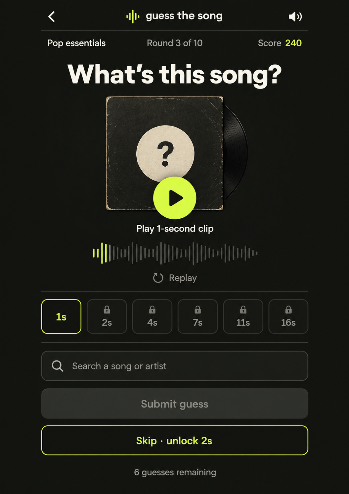

# Music guessing game — screen concepts

Generated previews for the 2026-10-04 design-first request. These are illustrative UI concepts, not an implemented app. The catalog, player names, room code, score and round progress are mock data. Brand name, final artwork and catalog provider remain undecided.

Recommended direction: a warm charcoal record-store interface with cream typography, acid-lime primary controls, original sleeve artwork, and a focused mystery-vinyl listening screen. Bright arcade and light editorial directions were considered; the selected direction balances music discovery with quick recognition play.

Four planned outputs: desktop discovery, desktop guessing round, friends lobby, and mobile guessing round. No implementation is authorized by this preview receipt. Any future implementation should first revalidate product scope and the chosen design.

The [preview receipt](preview-receipt.json) contains the frozen direction, reference evidence, coverage, and exact generation prompts. All requested images will be saved beside it.

Generated with the built-in imagegen tool: four calls, four reviewed concept images. [Exact generation prompts](prompts.md).

1. Desktop discovery — quick play, daily challenge, music packs, and genre / decade / language filters.

2. Desktop guessing round — anonymous track, listening stages, replay, song search, skip, and volume.

3. Friends party lobby — invite code, players, shared playlist, and host controls.

4. Mobile guessing layout — the same round in a focused portrait arrangement.

Desktop image dimensions: 1586 × 992 each. Mobile image dimensions: 1055 × 1491. The mobile image is a portrait layout study and differs from the preferred device aspect; exact responsive layout and touch sizing remain for implementation. Generated artwork and supporting copy are proposed design material.

[Review notes](review.json). Functional references were inspected on 2026-10-04: [Guess Dat Song](https://guessdatsong.com/) and [Bandle daily](https://bandle.app/daily). Their branding, artwork and screen geometry were not supplied as renderer inputs.

