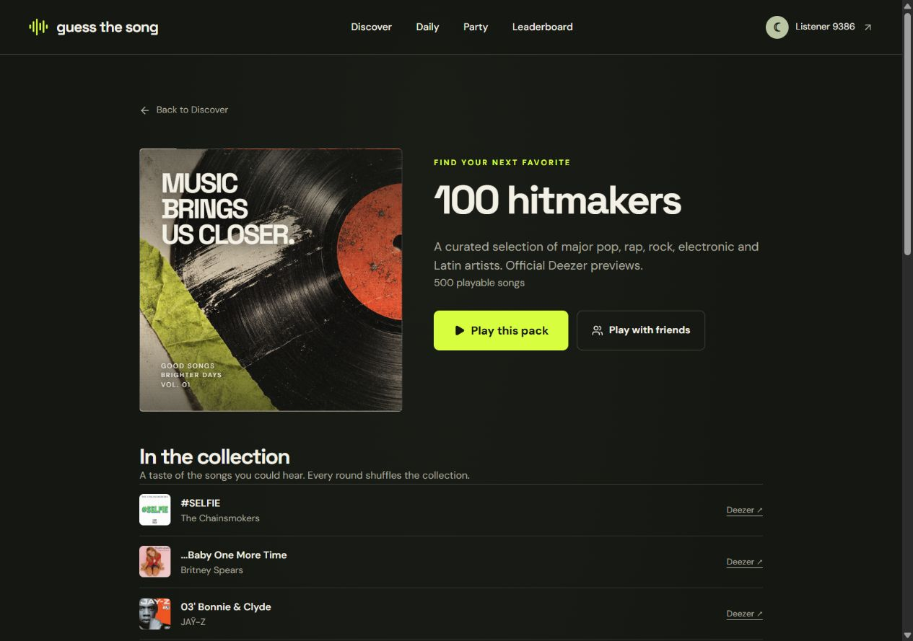
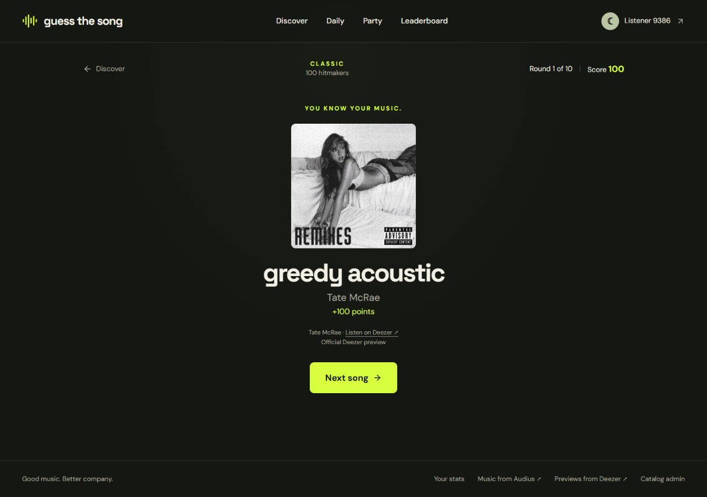
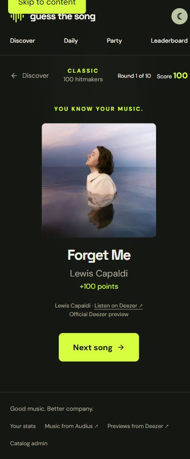

# Public hit previews — 2026-10-06

The [production game](https://guessthesong-rust.vercel.app/play/classic?pack=featured-hits) serves **500 selected official previews across 100 recognizable artists**, with five distinct recordings per artist. The full library has **2,002 available recordings**: 1,500 Audius songs, the 500-song shortlist, and two retained Metallica previews. The operator reported obtaining permission for this application's public playback; forks remain disabled by default.

The [complete song list](../data/featured-hitmakers.md), [importable metadata](../data/featured-hitmakers.json), and [dated playback results for all 500 recording IDs](../data/featured-hitmakers-playback.json) are committed. They contain no music files, signed audio URLs, administrator sessions or database credentials. This is an editorial selection of familiar artists, not an official worldwide Top 100 chart.

## Hosted audio and saved results

- **500/500 recording checks passed; 0 unavailable.** Four isolated QA guests fetched each selected song through the application's authenticated, opaque audio endpoint. Every first-stage request required HTTP 206, `audio/mpeg`, at least 1,000 bytes and an MPEG-frame signature. The range was `bytes=0-4095` within the server-bounded one-second clip. QA guests and games created by this probe were cleaned up; existing players were untouched.
- **Drake — God's Plan:** all six unlocked clips (1, 2, 4, 7, 11 and 16 seconds) returned actual MPEG audio, with increasing lengths of 15,882 / 31,764 / 63,947 / 111,595 / 175,960 / 255,791 bytes. The sixth-stage correct answer scored ten points. Repeating its command did not score again.
- The ten-round Classic game finished with **910 points**, persisted exactly once in Neon PostgreSQL. The production health endpoint reported `ok`.
- Another guest could not access the game or its audio token; anonymous audio access was rejected, and an out-of-bounds byte range returned HTTP 416. The initial public game response contained neither the answer's provider ID nor its CDN URL.
- Protected preview checks require the existing administrator session and accept at most twenty provider IDs. Search pagination accepts bounded integer offsets and returns canonical artist/album metadata without signed preview URLs.

These are checks of short previews, plus all six stages of one sampled song. They do not certify whole recordings or future availability. Initial testing found 55 locally available editions unavailable from the hosting region; those records were disabled, and working replacements were checked from Vercel. Metallica supplied only two eligible previews, so Bon Jovi fills its shortlist position with five tested songs. The wider library retains the two playable Metallica records. Three Nirvana selections use accurately labeled official live editions.

## Browser verification

The final deployment was checked at a **1280 × 900** desktop viewport. Discovery displayed 2,002 songs and the 500-song pack; pack details linked real artists and recordings. A fresh Classic game played **greedy acoustic — Tate McRae**: the waveform advanced and returned to its ready state, keyboard arrows and Enter selected the search result, and submitting it awarded **100 points** with the official artist, source link and preview credit. There were **zero console errors or warnings** during this flow and no horizontal overflow.

An earlier public-playback check at **390 × 844** exercised **Forget Me — Lewis Capaldi**, real audio, keyboard selection and the 100-point reveal. It also had no horizontal overflow. That check preceded the final catalog replacements; the player implementation was unchanged. Temporary browser viewport overrides were reset after testing.







## Genre and decade collections

The live discovery page showed these collections after the final import. Collections can overlap; these are pack counts, not disjoint partitions.

| Collection | Available recordings |
| --- | ---: |
| Pop | 462 |
| Hip-hop | 424 |
| Electronic | 418 |
| Indie & alternative | 350 |
| Rock | 223 |
| R&B & soul | 65 |
| House | 51 |
| Latin | 16 |
| 2010s | 304 |
| 2010s · Familiar artists | 243 |

Genres use provider album metadata or documented editorial fallbacks. Decades follow provider edition release dates, including reissues; missing dates are not guessed. Chart Clash continues to use Audius play-count snapshots and excludes Deezer previews.

## Source checks

The final catalog/selection suite passed **44 tests with zero failures**. Protected API, preview availability, pagination, source gating, audio and game-service suites also passed during this change. ESLint, TypeScript validation and the optimized Next.js production build passed. GitHub pushes triggered production deployments that reached **Ready** on Vercel.

With the documented local PostgreSQL/Redis setup running, the relevant checks can be repeated with:

```powershell
bun test tests/catalog-packs.test.ts tests/featured-hits.test.ts --env-file=.env.local
bun test tests/api.test.ts tests/deezer-admin.test.ts tests/deezer.test.ts --env-file=.env.local
bun run build
```

To review hosted candidates, use the protected endpoints described in [the source setup](featured-hitmakers.md#approved-public-playback). Check actual hosted playback before importing replacements; a successful local metadata response does not establish hosted availability.
